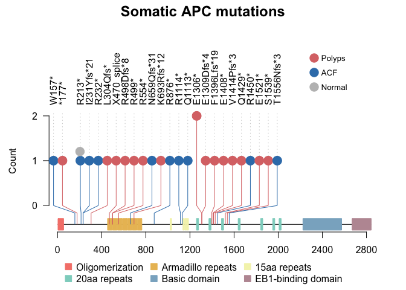
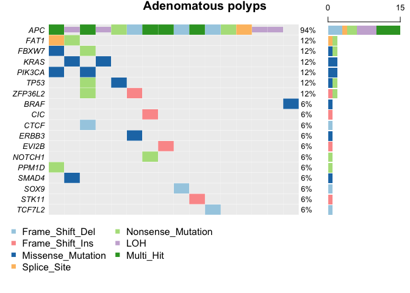
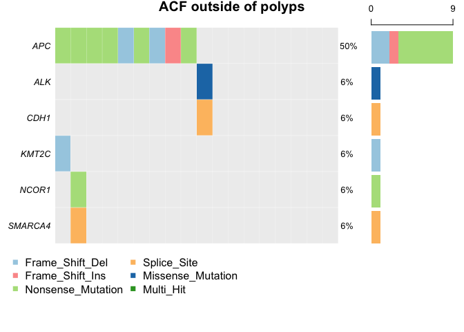
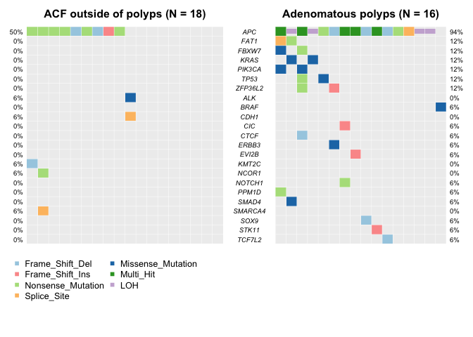

``` r
# setup
library(trackViewer)
library(maftools)
library(grid)
library(ggplot2)
library(tidyr)
library(dplyr)
library(ggpubr)
cols = c("#8DD3C7", "#CFECBB", "#F4F3B9", "#BD98A2", "#F5847A", "#8AB1C9", "#CECBD0",
    "#D3B387", "#8DD3C7", "#EABE63", "#BFD767", "#FCCDE5", "#8A8A8A")
```


``` r
# Visualise somatic APC mutations (data from ../data/somatic_driver_mutations.csv)
SNP <- c(1396,1414,177,1306,1429,1450,1539,    
         231,304,659,1309,157,213,232,499,554,876,1114,1408,1521,  
         1556,470, 
         498,693,1131)
sample.gr <- GRanges("chr5", IRanges(SNP, width=1, names=c('F1396Lfs*19','V1414Pfs*3','*177*','E1306*','Q1429*','R1450*', 'S1539*',    'I231Yfs*21','L304Qfs*','N659Qfs*31','E1309Dfs*4','W157*','R213*','R232*','R499*','R554*','R876*','R1114*','E1408*','E1521*',
'T1556Nfs*3','X470_splice',  
'R498Dfs*8','K693Rfs*12','Q1113*')))
group <- c('polyp','polyp','polyp','polyp','polyp','ACF','polyp',
           'ACF','polyp','ACF','polyp','ACF','ACF','ACF','polyp','polyp','ACF','ACF', 'polyp','polyp',
           'ACF','polyp',
           'polyp','polyp','ACF')
  
features <- GRanges("chr5", IRanges(c(4, 453, 498, 543, 588, 633, 678, 723, 1020,1136,1155,1173,1259,1372,1486,1637,1841,1950,2008,2224,2670), 
                                    width=c(52,42,42,42,42,42,42,42, 15,15,15,15,20,20,20,20,20,20,20,352,174),
                                    names=c("Oligomerization","Armadillo repeats","Armadillo repeats","Armadillo repeats","Armadillo repeats","Armadillo repeats","Armadillo repeats","Armadillo repeats","15aa repeats","15aa repeats","15aa repeats","15aa repeats","20aa repeats","20aa repeats","20aa repeats","20aa repeats","20aa repeats","20aa repeats","20aa repeats","Basic domain", "EB1-binding domain")))
features$fill <- c("#F5847A", "#EABE63", "#EABE63","#EABE63","#EABE63","#EABE63","#EABE63","#EABE63","#F4F3B9","#F4F3B9","#F4F3B9","#F4F3B9", "#8DD3C7", "#8DD3C7", "#8DD3C7", "#8DD3C7", "#8DD3C7", "#8DD3C7", "#8DD3C7","#8AB1C9","#BD98A2")
features$color <- c("#F5847A", "#EABE63", "#EABE63","#EABE63","#EABE63","#EABE63","#EABE63","#EABE63","#F4F3B9","#F4F3B9","#F4F3B9","#F4F3B9", "#8DD3C7", "#8DD3C7", "#8DD3C7", "#8DD3C7", "#8DD3C7", "#8DD3C7", "#8DD3C7","#8AB1C9","#BD98A2")
xaxis <-  seq(0, 2843, by = 400)
yaxis <-  seq(0, 2, by = 1)
features$height <- 0.05
group_colors <- c("polyp" = "#DB7575", "ACF" = "#377EB8", "normal" = "grey")
sample.gr$color <- group_colors[group]
sample.gr$border <- group_colors[group]
sample.gr$score <- 1
sample.gr$score[4] <- 2


lolliplot(sample.gr, features,xaxis=xaxis,yaxis=yaxis, lollipop_style_switch_limit=1, ylab='Count', cex.axis = 0.5, cex.lab = 0.5, cex.main = 0.5)
grid.text("Somatic APC mutations", x=.5, y=.98, just="top", 
          gp=gpar(cex=1.5, fontface="bold"))


pushViewport(viewport(width = 1, height = 1,
                      xscale = c(0, 2843), 
                      yscale = c(0, 2)))
grid.circle(x = unit(560, "native"), #446
            y = unit(0.955, "native"), #0.999
            r = unit(1.9, "mm"), #2.1
            gp = gpar(col = "grey", fill = "grey"))


# Define legend colors and labels.
legend_colors <- c("#DB7575", "#377EB8", "grey")   # red for polyps, blue for ACF, grey for normal
legend_labels <- c("Polyps", "ACF", "Normal")
y_positions <- unit(c(1.6, 1.5, 1.4), "native")

# Loop to add each legend entry
for(i in seq_along(legend_labels)) {
    grid.circle(x = unit(2200, "native"), y = y_positions[i],
                r = unit(1.9, "mm"),#2.1
                gp = gpar(col = legend_colors[i], fill = legend_colors[i]))
    grid.text(label = legend_labels[i], x = unit(2250, "native"), y = y_positions[i],
              just = "left", gp = gpar(fontsize = 10))
}


popViewport()
```

<!-- -->


``` r
# Oncoplot for polyps
maf_file = "../data/driver_mutation/polyp.maf"
cn.data = data.frame(Gene = "APC", Sample_name = c("PD44721N_PLP_006", "PD42778H_PLP_008",
    "PD42778D_PLP_003", "PD44721I_PLP_002_2"), CN = "LOH", stringsAsFactors = FALSE)

all_cols = RColorBrewer::brewer.pal(n = 9, name = "Paired")
names(all_cols) = c("Frame_Shift_Del", "Missense_Mutation", "Nonsense_Mutation",
    "Multi_Hit", "Frame_Shift_Ins", "In_Frame_Ins", "Splice_Site", "In_Frame_Del",
    "LOH")
polyp_maf = read.maf(maf = maf_file, cnTable = cn.data, verbose = FALSE)
oncoplot(maf = polyp_maf, drawColBar = F, colors = all_cols, top = 100, bgCol = "#EEEEEE",
    titleText = "Adenomatous polyps")
```

<!-- -->


``` r
# Oncoplot for ACF
maf_file = "../data/driver_mutation/acf.maf"
acf_maf = read.maf(maf = maf_file, verbose = FALSE)
oncoplot(maf = acf_maf, drawColBar = F, colors = all_cols, top = 100, bgCol = "#EEEEEE",
    titleText = "ACF outside of polyps")
```

<!-- -->


``` r
# Merge oncoplot for polyps and ACF
coOncoplot(m1 = acf_maf, m2 = polyp_maf, genes = unique(c(acf_maf@gene.summary$Hugo_Symbol,
    polyp_maf@gene.summary$Hugo_Symbol)), m1Name = "ACF outside of polyps", m2Name = "Adenomatous polyps",
    colors = all_cols, bgCol = "#EEEEEE", removeNonMutated = FALSE, geneNamefont = 0.6)
```

<!-- -->

