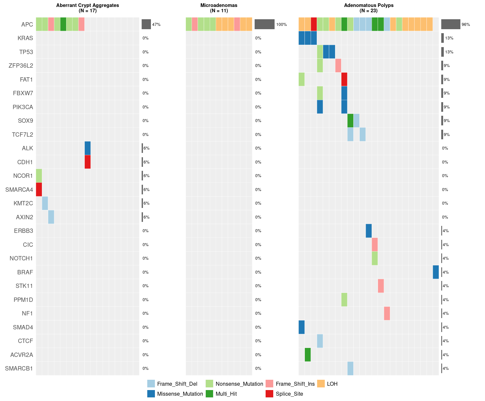

## Setup


``` r
suppressPackageStartupMessages({
  library(ggplot2)
  library(patchwork)
  library(RColorBrewer)
})
```


``` r
ROOT     <- "/lustre/scratch125/casm/teams/team267/users/yw2/colon/github_repo"
OUT_DIR  <- file.path(ROOT, "Fig1_Driver_mutation")
FAP_DB   <- file.path(ROOT, "data/fap_database_withexposure.csv")

CATEGORIES <- c("bc", "aca", "microadenoma", "polyp", "trapped")
SEVERITY_ORDER <- c("bc", "aca", "microadenoma", "polyp")
CATEGORY_TITLES <- c(
  bc      = "Bifurcating crypts (non-trapped)",
  aca     = "Aberrant Crypt Aggregates",
  microadenoma = "Microadenomas",
  polyp   = "Polyps",
  trapped = "Trapped bystanders (normal/RC)"
)

VC_LEVELS <- c("Frame_Shift_Del", "Missense_Mutation", "Nonsense_Mutation", "Multi_Hit",
               "Frame_Shift_Ins", "Splice_Site", "LOH", "None")
vc_cols <- c(RColorBrewer::brewer.pal(n = length(VC_LEVELS) - 1, name = "Paired"), "#EEEEEE")
names(vc_cols) <- VC_LEVELS

CLASS_MAP <- c(Nonsense = "Nonsense_Mutation", Missense = "Missense_Mutation",
               Splice = "Splice_Site", Frame_Shift_Del = "Frame_Shift_Del", Frame_Shift_Ins = "Frame_Shift_Ins")
```

## Category membership and driver calls


``` r
## ---------------- category membership (full universe, from fap_database) ----------------
db <- read.csv(FAP_DB, header = TRUE, stringsAsFactors = FALSE, check.names = FALSE, na.strings = c("", "NA"))
db$is_trapped <- !is.na(db$trapped_in_polyp)
db$is_cnv <- db$somatic1 %in% c("Chr5LOH", "Chr5CNNLOH") | db$somatic2 %in% c("Chr5LOH", "Chr5CNNLOH")

category_rows <- list(
  bc      = db[db$type == "bc", ],
  aca     = db[db$type == "aca", ],
  microadenoma = db[db$type %in% c("monocryptal_adenoma", "oligocryptal_adenoma"), ],
  polyp   = db[db$type %in% c("diminutive_polyp", "large_polyp"), ],
  trapped = db[db$type == "trapped_crypt", ]
)
```


``` r
somatic_drivers <- read.csv(file.path(ROOT, "data/driver_mutation/somatic_drivers.csv"), stringsAsFactors = FALSE)
somatic_drivers <- somatic_drivers[somatic_drivers$is.supressor == "Y" | somatic_drivers$is.hotspot == "Y", ]
trapped_by_group <- tapply(db$is_trapped, db$group_id, any) 
somatic_drivers$is_trapped <- trapped_by_group[somatic_drivers$Group_ID]

driver_details <- list(
  bc      = somatic_drivers[somatic_drivers$Type == "bc" & !somatic_drivers$is_trapped, ],
  aca     = somatic_drivers[somatic_drivers$Type == "aca" & !somatic_drivers$is_trapped, ],
  microadenoma = somatic_drivers[somatic_drivers$Type %in% c("monocryptal_adenoma", "oligocryptal_adenoma"), ],
  polyp   = somatic_drivers[somatic_drivers$Type %in% c("diminutive_polyp", "large_polyp"), ],
  trapped = somatic_drivers[somatic_drivers$Type == "trapped_crypt", ]
)
```


``` r
## ---------------- build (Gene, Group_ID, Variant_Classification) long table per category ----------------
build_events <- function(cat) {
  muts <- driver_details[[cat]]
  ev <- data.frame(Gene = muts$Gene, Group_ID = muts$Group_ID,
                    Variant_Classification = unname(CLASS_MAP[muts$Mutation_Type]), stringsAsFactors = FALSE)
  cnv_groups <- unique(category_rows[[cat]]$group_id[category_rows[[cat]]$is_cnv])
  if (length(cnv_groups) > 0) {
    ev <- rbind(ev, data.frame(Gene = "APC", Group_ID = cnv_groups, Variant_Classification = "LOH", stringsAsFactors = FALSE))
  }
  # collapse >1 distinct classification for the same (Gene, Group_ID) to Multi_Hit
  ev <- aggregate(Variant_Classification ~ Gene + Group_ID, data = ev,
                   FUN = function(x) if (length(unique(x)) > 1) "Multi_Hit" else x[1])
  ev
}

## memoSort: order genes by frequency (desc), then samples by a binary
## "staircase" score so the most-mutated gene's samples cluster leftmost.
memo_sort_samples <- function(bin_mat) {
  gene_order <- order(rowSums(bin_mat), decreasing = TRUE)
  m <- bin_mat[gene_order, , drop = FALSE]
  weights <- 2^(rev(seq_len(nrow(m))) - 1)
  score <- colSums(m * weights)
  list(gene_order = rownames(m), sample_order = colnames(m)[order(-score)])
}
```

## Combined oncoplot (Aberrant Crypt Aggregates | Microadenomas | Adenomatous Polyps).


``` r
COMBINED_ORDER <- c("aca", "microadenoma", "polyp")

all_groups_by_cat <- lapply(COMBINED_ORDER, function(cat) unique(category_rows[[cat]]$group_id))
names(all_groups_by_cat) <- COMBINED_ORDER

ev_all <- do.call(rbind, lapply(COMBINED_ORDER, build_events))
genes_all <- unique(ev_all$Gene)
full_groups_all <- unlist(all_groups_by_cat, use.names = FALSE)
n_total_all <- length(full_groups_all)

bin_mat_all <- matrix(0, nrow = length(genes_all), ncol = n_total_all,
                       dimnames = list(genes_all, full_groups_all))
for (i in seq_len(nrow(ev_all))) bin_mat_all[ev_all$Gene[i], ev_all$Group_ID[i]] <- 1

# order: block by category (aca, then microadenoma, then polyp, so the two
# adenoma subtypes stay contiguous and in that order), memoSort mutated
# samples within each block, WT samples appended per block.
sample_order_all <- unlist(lapply(COMBINED_ORDER, function(cat) {
  grp <- all_groups_by_cat[[cat]]
  mutated <- grp[colSums(bin_mat_all[, grp, drop = FALSE]) > 0]
  wt <- setdiff(grp, mutated)
  if (length(mutated) > 0) {
    ord <- memo_sort_samples(bin_mat_all[, mutated, drop = FALSE])
    c(ord$sample_order, sort(wt))
  } else sort(wt)
}))
gene_order_all <- names(sort(rowSums(bin_mat_all), decreasing = TRUE))

plot_df <- expand.grid(Gene = gene_order_all, Group_ID = sample_order_all, stringsAsFactors = FALSE)
plot_df <- merge(plot_df, ev_all, by = c("Gene", "Group_ID"), all.x = TRUE)
plot_df$Variant_Classification[is.na(plot_df$Variant_Classification)] <- "None"
plot_df$Variant_Classification <- factor(plot_df$Variant_Classification, levels = VC_LEVELS)
plot_df$Gene <- factor(plot_df$Gene, levels = rev(gene_order_all))
plot_df$Group_ID <- factor(plot_df$Group_ID, levels = sample_order_all)

pct_by_type <- do.call(rbind, lapply(COMBINED_ORDER, function(cat) {
  grp <- all_groups_by_cat[[cat]]
  data.frame(Gene = factor(gene_order_all, levels = rev(gene_order_all)),
             cat = cat,
             pct = sapply(gene_order_all, function(g) round(sum(bin_mat_all[g, grp] > 0) / length(grp) * 100)),
             stringsAsFactors = FALSE)
}))

# Three visual panels, each with its own strip title/N.
cat_lookup <- setNames(rep(COMBINED_ORDER, sapply(all_groups_by_cat, length)), full_groups_all)

panel_labels <- c(
  aca          = paste0(CATEGORY_TITLES[["aca"]], "\n(N = ", length(all_groups_by_cat$aca), ")"),
  microadenoma = paste0("Microadenomas\n(N = ", length(all_groups_by_cat$microadenoma), ")"),
  polyp        = paste0("Adenomatous Polyps\n(N = ", length(all_groups_by_cat$polyp), ")")
)
plot_df$Category <- factor(panel_labels[cat_lookup[as.character(plot_df$Group_ID)]],
                            levels = panel_labels[COMBINED_ORDER])
plot_df$Gene <- factor(as.character(plot_df$Gene), levels = rev(gene_order_all))
pct_by_type$Gene <- factor(as.character(pct_by_type$Gene), levels = rev(gene_order_all))
pct_by_type$Category <- factor(panel_labels[pct_by_type$cat], levels = panel_labels[COMBINED_ORDER])

pct_max <- max(pct_by_type$pct, na.rm = TRUE)
n_cat <- lengths(all_groups_by_cat)[COMBINED_ORDER]

# chunk-option figure dimensions for the plotting chunk below (knitr
# evaluates fig.width/fig.height as R expressions against the environment at
# the point each chunk runs, so these just need to exist before then).
fig_height <- 0.35 * length(gene_order_all) + 3.5
fig_width  <- max(8, 0.2 * n_total_all + 5)
legend_height <- 0.5
```


``` r
blocks <- vector("list", 2 * length(COMBINED_ORDER))
widths <- numeric(2 * length(COMBINED_ORDER))
for (i in seq_along(COMBINED_ORDER)) {
  cat_i <- COMBINED_ORDER[i]
  grp <- all_groups_by_cat[[cat_i]]
  df_cat <- plot_df[as.character(plot_df$Group_ID) %in% grp, ]
  pct_cat <- pct_by_type[pct_by_type$cat == cat_i, ]

  tile_cat <- ggplot(df_cat, aes(x = Group_ID, y = Gene, fill = Variant_Classification)) +
    geom_tile(color = "white", linewidth = 0.2) +
    scale_fill_manual(values = vc_cols, breaks = setdiff(VC_LEVELS, "None"), name = NULL, drop = FALSE) +
    labs(title = panel_labels[[cat_i]]) +
    theme_minimal() +
    theme(axis.text.x = element_blank(), axis.ticks = element_blank(), axis.title = element_blank(),
          axis.text.y = if (i == 1) element_text(size = 13) else element_blank(),
          panel.grid = element_blank(), plot.margin = margin(2, 2, 2, 2),
          legend.position = "none",
          plot.title = element_text(face = "bold", size = 11, hjust = 0.5))

  pct_plot_cat <- ggplot(pct_cat, aes(x = pct, y = Gene)) +
    geom_col(fill = "grey40", width = 0.7, na.rm = TRUE) +
    geom_text(aes(label = paste0(pct, "%")), hjust = -0.15, size = 3.2, na.rm = TRUE) +
    scale_x_continuous(limits = c(0, pct_max * 1.6 + 25), expand = c(0, 0)) +
    scale_y_discrete(drop = FALSE) +
    theme_void() +
    theme(plot.margin = margin(2, 10, 2, 2))

  blocks[[2 * i - 1]] <- tile_cat
  blocks[[2 * i]]     <- pct_plot_cat
  # tile width scales with that category's own sample count (so column width
  # stays visually consistent across panels)
  widths[2 * i - 1] <- n_cat[[cat_i]]
  widths[2 * i]     <- 6
}

main_row <- patchwork::wrap_plots(blocks, nrow = 1, widths = widths)

legend_ref <- ggplot(plot_df, aes(x = Group_ID, y = Gene, fill = Variant_Classification)) +
  geom_tile() +
  scale_fill_manual(values = vc_cols, breaks = setdiff(VC_LEVELS, "None"), name = NULL, drop = FALSE) +
  theme(legend.position = "bottom", legend.text = element_text(size = 12))
legend_grob <- ggplotGrob(legend_ref)$grobs[[which(sapply(ggplotGrob(legend_ref)$grobs, `[[`, "name") == "guide-box")]]

layout <- main_row / patchwork::wrap_elements(full = legend_grob) +
  patchwork::plot_layout(heights = c(fig_height - legend_height, legend_height))

out_pdf <- file.path(OUT_DIR, "combined_oncoplot.pdf")
ggsave(out_pdf, layout, width = fig_width, height = fig_height, limitsize = FALSE)
cat("Wrote", out_pdf, "\n")
```

```
## Wrote /lustre/scratch125/casm/teams/team267/users/yw2/colon/github_repo/Fig1_Driver_mutation/combined_oncoplot.pdf
```

``` r
layout
```

<!-- -->
