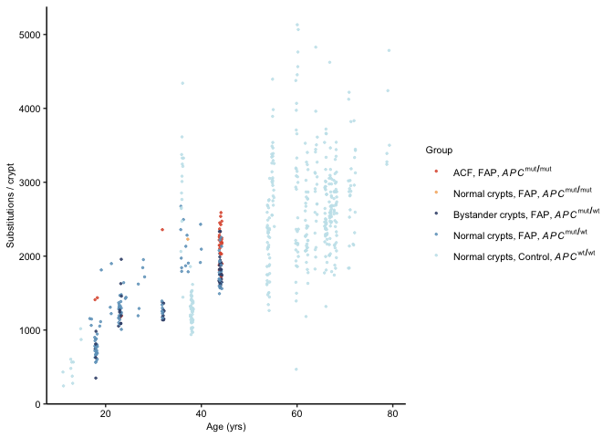
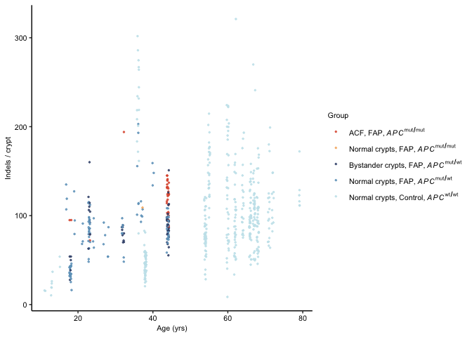
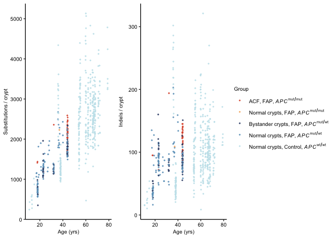
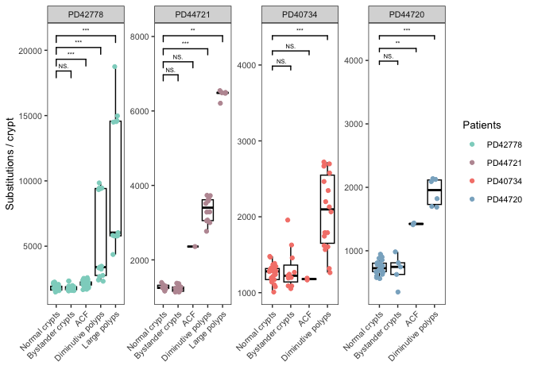
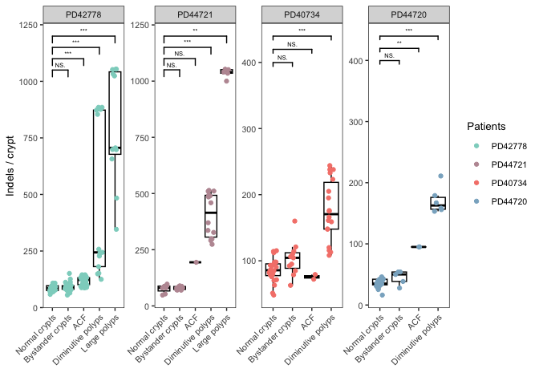

``` r
library(ggplot2)
library(ggpubr)
library(grid)
library(tidyverse)
library(ggbreak)
library(ggsignif)
```


``` r
database = read.csv("../data/fap_database_withexposure.csv", header = T)
ctrl_database = read.csv("../data/ctrl_database_withexposure.csv", header = T)


full_dataset = rbind(database, ctrl_database)
full_dataset = full_dataset[full_dataset$coverage >= 10, ]
full_dataset$group[!is.na(full_dataset$germlinehit)] = "FAP"
full_dataset$group[is.na(full_dataset$germlinehit)] = "Control"
full_dataset$num_drivers = 8 - (is.na(full_dataset$somatic1) + is.na(full_dataset$somatic2) +
    is.na(full_dataset$germlinehit) + is.na(full_dataset$TP53) + is.na(full_dataset$KRAS) +
    is.na(full_dataset$SMAD4) + is.na(full_dataset$FBXW7) + is.na(full_dataset$PIK3CA))
df = full_dataset[, c("sample", "patient", "age", "type", "sbstotal_corr", "indeltotal_corr",
    "group", "num_drivers", "trapped_in_polyp")]

df$type[df$group == "Control"] = "Normal crypts, Control, APC wt/wt"
df$type[df$num_drivers > 1 & df$type == "normal"] = "Normal crypts, FAP, APC mut/mut"
df$type[df$group == "FAP" & df$type == "normal" & is.na(df$trapped_in_polyp)] = "Normal crypts, FAP, APC mut/wt"
df$type[df$type == "acf" & df$num_drivers > 1] = "ACF, FAP, APC mut/mut"
df$type[df$type %in% c("polyp", "large polyp")] = "Polyps, FAP"
df$type[(df$num_drivers < 2) & df$type %in% c("acf", "normal") & !is.na(df$trapped_in_polyp)] = "Bystander crypts, FAP, APC mut/wt"
df$type[(df$num_drivers < 2) & df$type %in% c("acf")] = "Bystander crypts, FAP, APC mut/wt"
df = df[df$type != "Polyps, FAP", ]
df$type = factor(df$type, levels = c("ACF, FAP, APC mut/mut", "Normal crypts, FAP, APC mut/mut",
    "Bystander crypts, FAP, APC mut/wt", "Normal crypts, FAP, APC mut/wt", "Normal crypts, Control, APC wt/wt"))

dot_cols = c("#DF5B3F", "#F5B46F", "#3E517A", "#70A3C4", "#C7E5EC")
names(dot_cols) = c("ACF, FAP, APC mut/mut", "Normal crypts, FAP, APC mut/mut", "Bystander crypts, FAP, APC mut/wt",
    "Normal crypts, FAP, APC mut/wt", "Normal crypts, Control, APC wt/wt")

labels_parse <- c("ACF*','~FAP*','~italic(APC)^{mut/mut}", "Normal~crypts*','~FAP*','~italic(APC)^{mut/mut}",
    "Bystander~crypts*','~FAP*','~italic(APC)^{mut/wt}", "Normal~crypts*','~FAP*','~italic(APC)^{mut/wt}",
    "Normal~crypts*','~Control*','~italic(APC)^{wt/wt}")
sbs_dot_plot <- ggplot(data = df, mapping = aes(x = age, y = sbstotal_corr)) + geom_jitter(aes(colour = type),
    width = 0.3, height = 0, alpha = 0.8, size = 0.5) + scale_color_manual(name = "Group",
    values = dot_cols, labels = parse(text = labels_parse)) + theme_bw() + theme(panel.grid = element_blank(),
    panel.border = element_blank(), axis.line = element_line(size = 0.5, colour = "black")) +
    labs(y = "Substitutions / crypt", x = "Age (yrs)") + theme(title = element_text(size = 8),
    axis.text.y = element_text(size = 8, color = "black"), axis.text.x = element_text(size = 8,
        color = "black"), legend.text = element_text(size = 8))

sbs_dot_plot
```

<!-- -->


``` r
indel_dot_plot = ggplot(data = df, mapping = aes(x = age, y = indeltotal_corr)) +
    # geom_point(aes(colour = type), size=0.5, alpha = 0.6) +
geom_jitter(aes(colour = type), width = 0.3, height = 0, alpha = 0.8, size = 0.5) +
    scale_color_manual(name = "Group", values = dot_cols, labels = parse(text = labels_parse)) +
    theme_bw() + theme(panel.grid = element_blank(), panel.border = element_blank(),
    axis.line = element_line(size = 0.5, colour = "black")) + labs(y = "Indels / crypt",
    x = "Age (yrs)") + theme(title = element_text(size = 8), axis.text.y = element_text(size = 8,
    color = "black"), axis.text.x = element_text(size = 8, color = "black"), legend.text = element_text(size = 8))
indel_dot_plot
```

<!-- -->


``` r
dot_plot = ggarrange(sbs_dot_plot, indel_dot_plot, ncol = 2, nrow = 1, common.legend = TRUE,
    legend = "right", align = "v")
# pdf(paste0('../../figure/Fig2/burden_vs_age.pdf'),width = 7, height = 3)
# dot_plot dev.off()
dot_plot
```

<!-- -->


``` r
database = read.csv("../data/fap_database_withexposure.csv", header = T)

df = database[database$coverage >= 10, ]
df$group = "FAP"
df$num_drivers = 8 - (is.na(df$somatic1) + is.na(df$somatic2) + is.na(df$germlinehit) +
    is.na(df$TP53) + is.na(df$KRAS) + is.na(df$SMAD4) + is.na(df$FBXW7) + is.na(df$PIK3CA))

df$type[df$type == "normal" & is.na(df$trapped_in_polyp)] = "Normal crypts"
df$type[df$num_drivers > 1 & df$type == "normal"] = "Normal crypts, APC mut/mut"
df$type[df$type == "acf" & df$num_drivers > 1] = "ACF"
df$type[df$type == "polyp"] = "Diminutive polyps"
df$type[df$type == "large polyp"] = "Large polyps"
df$type[df$type == "polyp" & df$num_drivers == 1] = "Diminutive polyps, APC mut/wt"
df$type[(df$num_drivers < 2) & df$type %in% c("acf", "normal") & !is.na(df$trapped_in_polyp)] = "Bystander crypts"
df$type[(df$num_drivers < 2) & df$type %in% c("acf")] = "Bystander crypts"
df$type = factor(df$type, levels = c("Normal crypts", "Normal crypts, APC mut/mut",
    "Bystander crypts", "Diminutive polyps, APC mut/wt", "ACF", "Diminutive polyps",
    "Large polyps"))
```


``` r
# cols = c('#8DD3C7', '#BD98A2','#F5847A', '#8AB1C9','#CECBD0', '#D3B387',
# '#759696','#EABE63','#BFD767', '#FCCDE5','#8A8A8A' )
cols = c("#8DD3C7", "#BD98A2", "#F5847A", "#8AB1C9")
names(cols) = c("PD42778", "PD44721", "PD40734", "PD44720")
df = df[df$patient %in% c("PD42778", "PD44721", "PD40734", "PD44720"), ]
df$patient <- factor(df$patient, levels = c("PD42778", "PD44721", "PD40734", "PD44720"))


df = df[df$type != "Diminutive polyps, APC mut/wt", ]
p_sbs <- ggplot(df, aes(x = type, y = sbstotal_corr)) + geom_boxplot(fill = "white",
    color = "black", outlier.shape = NA) + geom_jitter(aes(color = patient), width = 0.2,
    alpha = 1) + facet_wrap(~patient, ncol = 4, scales = "free") + theme_minimal() +
    theme_bw() + theme(text = element_text(size = 10), axis.text.x = element_text(angle = 45,
    hjust = 1), panel.grid = element_blank()) + labs(x = "", y = "Substitutions / crypt") +
    scale_colour_manual(values = cols, name = "Patients")

signif_data <- data.frame(patient = c("PD42778", "PD42778", "PD42778", "PD42778",
    "PD44721", "PD44721", "PD44721", "PD44721", "PD40734", "PD40734", "PD40734",
    "PD44720", "PD44720", "PD44720"), group1 = c("Normal crypts", "Normal crypts",
    "Normal crypts", "Normal crypts", "Normal crypts", "Normal crypts", "Normal crypts",
    "Normal crypts", "Normal crypts", "Normal crypts", "Normal crypts", "Normal crypts",
    "Normal crypts", "Normal crypts"), group2 = c("Bystander crypts", "ACF", "Diminutive polyps",
    "Large polyps", "Bystander crypts", "ACF", "Diminutive polyps", "Large polyps",
    "Bystander crypts", "ACF", "Diminutive polyps", "Bystander crypts", "ACF", "Diminutive polyps"),
    y_position = c(17550, 18450, 19350, 20250, 6700, 7050, 7400, 7750, 3900, 4100,
        4300, 3900, 4100, 4300))

for (i in 1:nrow(signif_data)) {
    p_sbs <- p_sbs + geom_signif(data = subset(df, patient == signif_data$patient[i]),
        comparisons = list(c(signif_data$group1[i], signif_data$group2[i])), y_position = signif_data$y_position[i],
        map_signif_level = TRUE, textsize = 2)
}


p_sbs
```

<!-- -->


``` r
p_id <- ggplot(df, aes(x = type, y = indeltotal_corr)) + geom_boxplot(fill = "white",
    color = "black", outlier.shape = NA) + geom_jitter(aes(color = patient), width = 0.2,
    alpha = 1) + facet_wrap(~patient, ncol = 4, scales = "free") + theme_minimal() +
    theme_bw() + theme(text = element_text(size = 10), axis.text.x = element_text(angle = 45,
    hjust = 1), panel.grid = element_blank()) + labs(x = "", y = "Indels / crypt") +
    # scale_fill_manual(values=cols)+
scale_colour_manual(values = cols, name = "Patients")


signif_data <- data.frame(patient = c("PD42778", "PD42778", "PD42778", "PD42778",
    "PD44721", "PD44721", "PD44721", "PD44721", "PD40734", "PD40734", "PD40734",
    "PD44720", "PD44720", "PD44720"), group1 = c("Normal crypts", "Normal crypts",
    "Normal crypts", "Normal crypts", "Normal crypts", "Normal crypts", "Normal crypts",
    "Normal crypts", "Normal crypts", "Normal crypts", "Normal crypts", "Normal crypts",
    "Normal crypts", "Normal crypts"), group2 = c("Bystander crypts", "ACF", "Diminutive polyps",
    "Large polyps", "Bystander crypts", "ACF", "Diminutive polyps", "Large polyps",
    "Bystander crypts", "ACF", "Diminutive polyps", "Bystander crypts", "ACF", "Diminutive polyps"),
    y_position = c(1000, 1050, 1100, 1150, 1000, 1050, 1100, 1150, 390, 410, 430,
        390, 410, 430))

for (i in 1:nrow(signif_data)) {
    p_id <- p_id + geom_signif(data = subset(df, patient == signif_data$patient[i]),
        comparisons = list(c(signif_data$group1[i], signif_data$group2[i])), y_position = signif_data$y_position[i],
        map_signif_level = TRUE, textsize = 2)
}


p_id
```

<!-- -->

``` r
# pdf('/Users/yw2/Library/CloudStorage/OneDrive-UniversityofCambridge/PhD/fap/figure/Fig1/Indel_boxplot.pdf',width
# = 7, height = 3.5) p_id dev.off()
# pdf('/Users/yw2/Library/CloudStorage/OneDrive-UniversityofCambridge/PhD/fap/figure/Fig1/SBS_boxplot.pdf',width
# = 7, height = 3.5) p_sbs dev.off()
```
