``` r
library(ggplot2)
library(RColorBrewer)
library(nlme)
library(ggpubr)
library(grid)
library(tidyverse)
library(ggtext)
```


``` r
database = read.csv('../data/fap_database_withexposure.csv',header=T)
ctrl_database = read.csv('../data/ctrl_database_withexposure.csv',header=T)
full_dataset = rbind(database,ctrl_database)
full_dataset=full_dataset[full_dataset$coverage>=10,]

full_dataset$group = 'Control'
full_dataset$group[!is.na(full_dataset$germlinehit)] = 'FAP'

full_dataset = full_dataset[!full_dataset$type %in% c('polyp','large polyp'),]
full_dataset$num_APC = 3-(is.na(full_dataset$somatic1)+is.na(full_dataset$somatic2)+is.na(full_dataset$germlinehit))

full_dataset$type[full_dataset$num_APC>1 & full_dataset$type=='normal'] = 'Normal, APC mut/mut'
full_dataset$type[(full_dataset$num_APC<2) & full_dataset$type %in% c('acf','normal') ]= 'Normal and bystander, APC mut/wt'
full_dataset$type[(full_dataset$num_APC==2) & full_dataset$type == 'acf' ]= 'ACF, APC mut/mut'

# SBS
sig_order=1:10
names(sig_order)=c("SBS1","SBS5","SBS18","SBS2","SBS13","SBS88",'SBS89','SBSC',"SBS17b",'SBS93')

getPalette = colorRampPalette(brewer.pal(9, "Set3"))
all_cols=getPalette(9)
all_cols=all_cols[1:8]
all_cols=c(all_cols,"magenta","firebrick")
names(all_cols)=c("SBS1","SBS5","SBS18","SBS2","SBS13","SBS88",'SBS89','SBSC',"SBS17b",'SBS93')

# colnames(full_dataset)
SBS_sig_proportion <- full_dataset[,c("sample","patient","age","type","sbstotal_corr", "group",
                "SBS1","SBS5","SBS18","SBS2","SBS13","SBS88",'SBS89','SBSC',"SBS17b",'SBS93')]

SBS_sig_proportion[,grep('SBS',colnames(SBS_sig_proportion))]= SBS_sig_proportion[,grep('SBS',colnames(SBS_sig_proportion))]/full_dataset$sbstotal_corr

SBS_sig_proportion = SBS_sig_proportion[order(SBS_sig_proportion$age),]
SBS_sig_proportion$patient = factor(SBS_sig_proportion$patient, levels = unique(SBS_sig_proportion$patient))

SBS_sig_proportion <- gather(SBS_sig_proportion, E1, E2, -sample, -patient, -group, -age, -sbstotal_corr, -type)
SBS_sig_proportion$E1 <- factor(SBS_sig_proportion$E1, levels = c("SBS1","SBS5","SBS18","SBS2","SBS13","SBS88",'SBS89','SBSC',"SBS35","SBS17b","SBS93"))

plot_SBSexposre = ggplot(SBS_sig_proportion[SBS_sig_proportion$group=='FAP',], aes(x = sample, y = E2, fill = E1)) + geom_bar(stat = "identity", show.legend = FALSE) +
    scale_fill_manual(values = all_cols) + theme_bw() + 
  theme(text = element_text(size = 6),
        axis.title.x = element_text(vjust=5),
        axis.text.x = element_blank(),
    axis.ticks.x = element_blank(),
    panel.grid = element_blank(), 
    panel.border = element_blank(), 
    strip.text = element_blank(),
    panel.spacing.x = unit(0.2, "lines"),
    plot.margin = margin(0,0,0,0, "cm")) +
    labs(x = "Substitutions", y = "Proportion", fill = "Signatures") + facet_grid(cols = vars(patient),
    scales = "free_x", space = "free")


bar_cols = c('#4B543B','#F6C5AF','red')
bar_cols = c('grey','#915700','black')
names(bar_cols)=c('Normal and bystander, APC mut/wt','Normal, APC mut/mut','ACF, APC mut/mut')
plot_SBStotal <- ggplot(SBS_sig_proportion[SBS_sig_proportion$group == 'FAP',], aes(x = sample, y = sbstotal_corr,fill = type)) +
  geom_bar(alpha = 0.8, stat = "identity",position = position_dodge(0.99), show.legend = FALSE) + scale_fill_manual(values = bar_cols)+
  theme_bw() +
  theme(text = element_text(size = 6),
        axis.text.x = element_blank(),
        axis.ticks.x = element_blank(),
        panel.grid = element_blank(),
        panel.border = element_blank(),
        strip.text = element_blank(),
        axis.title.x = element_blank(),
        panel.spacing.x = unit(0.2, "lines"),
        plot.margin = margin(0,0,0,0, "cm")) +
  labs(x = "Subtitutions", y = "Burden") + facet_grid(cols = vars(patient),
    scales = "free_x", space = "free")

FAP_SBS_plot <- ggarrange(plot_SBStotal, plot_SBSexposre,
          ncol = 1, nrow=2,heights = c(1, 3), widths = c(6, 6),common.legend = TRUE, legend = "right", align = "v") 
FAP_SBS_plot
```

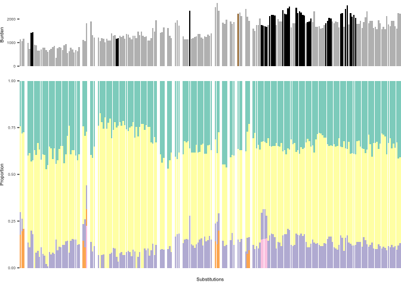<!-- -->

``` r
ggplot(SBS_sig_proportion[SBS_sig_proportion$group=='FAP',], aes(x = sample, y = E2, fill = E1)) + geom_bar(stat = "identity") +
    scale_fill_manual(values = all_cols) + theme_bw() + 
  theme(text = element_text(size = 6),
        axis.title.x = element_text(vjust=5),
        axis.text.x = element_blank(),
    axis.ticks.x = element_blank(),
    panel.grid = element_blank(), 
    panel.border = element_blank(), 
    strip.text = element_blank(),
    panel.spacing.x = unit(0.2, "lines"),
    plot.margin = margin(0,0,0,0, "cm")) +
    labs(x = "Substitutions", y = "Proportion", fill = "Signatures") + facet_grid(cols = vars(patient),
    scales = "free_x", space = "free")
```

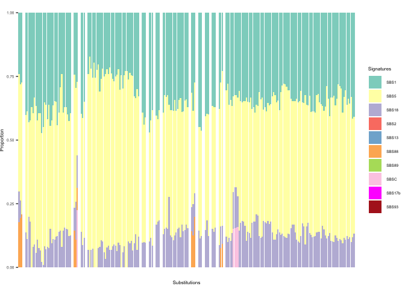<!-- -->

``` r
sig_order=1:7
names(sig_order)=c("ID1","ID2","ID18","ID14","IDA","IDB")

all_cols=c("#DDDCC7", "#FAEBEA", "#A6ADBA",'#F5B46F', "#DC978D","#533A4D","#6993A4")
names(all_cols)=c("ID1","ID2","ID5","ID18","ID14","IDA","IDB")

ID_sig_proportion <- full_dataset[,c("sample","patient","age","type","indeltotal_corr", "group",
                "ID1","ID2","ID5","ID18","ID14","IDA","IDB")]
ID_sig_proportion[,grep('ID',colnames(ID_sig_proportion))]= ID_sig_proportion[,grep('ID',colnames(ID_sig_proportion))]/full_dataset$indeltotal_corr

ID_sig_proportion = ID_sig_proportion[order(ID_sig_proportion$age),]
ID_sig_proportion$patient = factor(ID_sig_proportion$patient, levels = unique(ID_sig_proportion$patient))

ID_sig_proportion <- gather(ID_sig_proportion, E1, E2, -sample, -patient, -group, -age, -indeltotal_corr, -type)
ID_sig_proportion$E1 <- factor(ID_sig_proportion$E1, levels = c("ID1","ID2","ID5","ID18","ID14","IDA","IDB"))

ID_sig_proportion$E2[is.na(ID_sig_proportion$E2)] = 0
plot_IDexposre = ggplot(ID_sig_proportion[ID_sig_proportion$group=='FAP',], aes(x = sample, y = E2, fill = E1)) + geom_bar(stat = "identity", show.legend = FALSE) +
    scale_fill_manual(values = all_cols) + theme_bw() + 
  theme(text = element_text(size = 6),
        axis.title.x = element_text(vjust=5),
        axis.text.x = element_blank(),
    axis.ticks.x = element_blank(),
    panel.grid = element_blank(), 
    panel.border = element_blank(), 
    strip.text = element_blank(),
    panel.spacing.x = unit(0.2, "lines"),
    plot.margin = margin(0,0,0,0, "cm"),
    legend.position = "none") +
    labs(x = "Indels", y = "Proportion", fill = "Signatures") + facet_grid(cols = vars(patient),
    scales = "free_x", space = "free")


plot_IDtotal <- ggplot(ID_sig_proportion[ID_sig_proportion$group == 'FAP',], aes(x = sample, y = indeltotal_corr, fill = type)) +
  geom_bar(alpha = 0.8,stat = "identity",position = position_dodge(0.99), show.legend = FALSE) +  
  theme_bw() +scale_fill_manual(values = bar_cols)+
  theme(text = element_text(size = 6),
        axis.text.x = element_blank(),
        axis.ticks.x = element_blank(),
        panel.grid = element_blank(),
        panel.border = element_blank(),
        strip.text = element_blank(),
        axis.title.x = element_blank(),
        panel.spacing.x = unit(0.2, "lines"),
        plot.margin = margin(0,0,0,0, "cm")) +
  labs(x = "Indels", y = "Burden") + facet_grid(cols = vars(patient),
    scales = "free_x", space = "free")

FAP_ID_plot <- ggarrange(plot_IDtotal, plot_IDexposre,
          ncol = 1, nrow=2,heights = c(1, 3), widths = c(6, 6), common.legend = TRUE, legend = "right", align = "v") 
FAP_ID_plot 
```

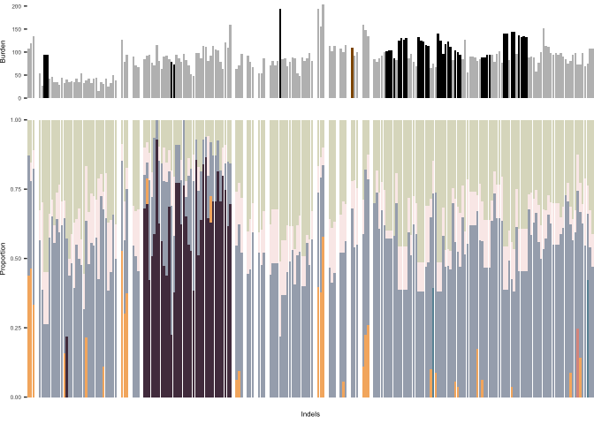<!-- -->


``` r
ggplot(ID_sig_proportion[ID_sig_proportion$group=='FAP',], aes(x = sample, y = E2, fill = E1)) + geom_bar(stat = "identity") +
    scale_fill_manual(values = all_cols) + theme_bw() + 
  theme(text = element_text(size = 6),
        axis.title.x = element_text(vjust=5),
        axis.text.x = element_blank(),
        axis.ticks.x = element_blank(),
        panel.grid = element_blank(), 
        panel.border = element_blank(), 
        strip.text = element_blank(),
        panel.spacing.x = unit(0.2, "lines"),
        plot.margin = margin(0,0,0,0, "cm")) +
        labs(x = "Indels", y = "Proportion", fill = "Signatures") + facet_grid(cols = vars(patient),
        scales = "free_x", space = "free")
```

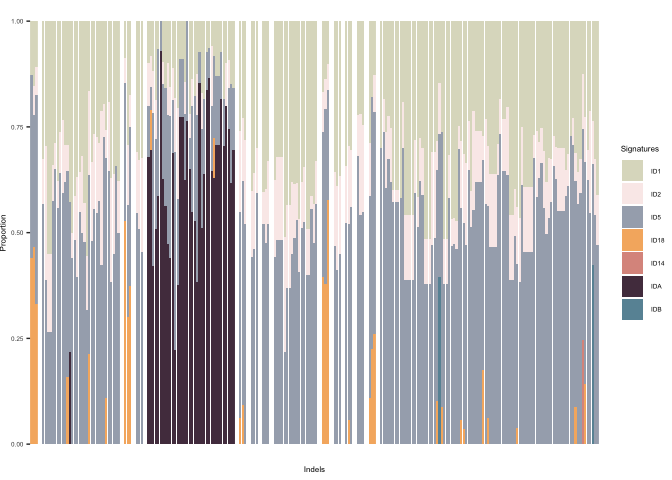<!-- -->


``` r
FAP_plot<-ggarrange(FAP_SBS_plot, FAP_ID_plot,
          ncol = 1, nrow=2, common.legend = TRUE, legend = "right",  align = "v") 
FAP_plot<-annotate_figure(FAP_plot, top = text_grob("FAP", 
               color = "black", face = "bold", size = 8))

# pdf(paste0("../../figure/Fig3/FAP_plot.pdf"),width = 5, height = 3)
# FAP_plot
# dev.off()
FAP_plot
```

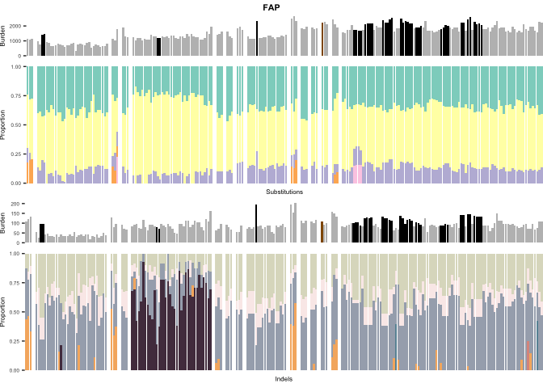<!-- -->


``` r
# SBS
sig_order=1:10
names(sig_order)=c("SBS1","SBS5","SBS18","SBS2","SBS13","SBS88",'SBS89','SBSC',"SBS17b",'SBS93')

getPalette = colorRampPalette(brewer.pal(9, "Set3"))
all_cols=getPalette(9)
all_cols=all_cols[1:8]
all_cols=c(all_cols,"magenta","firebrick")
names(all_cols)=c("SBS1","SBS5","SBS18","SBS2","SBS13","SBS88",'SBS89','SBSC',"SBS17b",'SBS93')


plot_SBSexposre = ggplot(SBS_sig_proportion[SBS_sig_proportion$group=='Control',], aes(x = sample, y = E2, fill = E1)) + geom_bar(stat = "identity", show.legend = FALSE) +
    scale_fill_manual(values = all_cols) + theme_bw() + 
  theme(text = element_text(size = 6),
        axis.title.x = element_text(vjust=5),
        axis.text.x = element_blank(),
    axis.ticks.x = element_blank(),
    panel.grid = element_blank(), 
    panel.border = element_blank(), 
    strip.text = element_blank(),
    panel.spacing.x = unit(0.2, "lines"),
    plot.margin = margin(0,0,0,0, "cm")) +
    labs(x = "Substitutions", y = "Proportion", fill = "Signatures") + facet_grid(cols = vars(patient),
    scales = "free_x", space = "free")


plot_SBStotal <- ggplot(SBS_sig_proportion[SBS_sig_proportion$group == 'Control',], aes(x = sample, y = sbstotal_corr, fill = type)) +
  geom_bar( alpha = 0.8, stat = "identity",position = position_dodge(0.99), show.legend = FALSE) +  # Add grey bar for 'burden'
  theme_bw() + scale_fill_manual(values = bar_cols)+
  theme(text = element_text(size = 6),
        axis.text.x = element_blank(),
        axis.ticks.x = element_blank(),
        panel.grid = element_blank(),
        panel.border = element_blank(),
        strip.text = element_blank(),
        axis.title.x = element_blank(),
        panel.spacing.x = unit(0.2, "lines"),
        plot.margin = margin(0,0,0,0, "cm")) +
  labs(x = "Subtitutions", y = "Burden") + facet_grid(cols = vars(patient),
    scales = "free_x", space = "free")

Control_SBS_plot <- ggarrange(plot_SBStotal, plot_SBSexposre,
          ncol = 1, nrow=2,heights = c(1, 3), widths = c(6, 6),common.legend = TRUE, legend = "right", align = "v") 
Control_SBS_plot
```

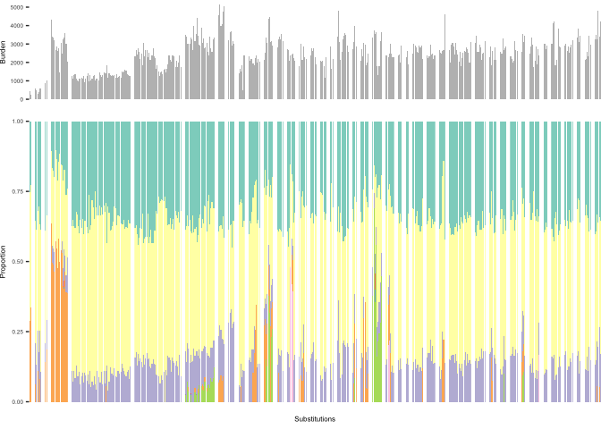<!-- -->


``` r
ggplot(SBS_sig_proportion[SBS_sig_proportion$group=='Control',], aes(x = sample, y = E2, fill = E1)) + geom_bar(stat = "identity") +
    scale_fill_manual(values = all_cols) + theme_bw() + 
  theme(text = element_text(size = 6),
        axis.title.x = element_text(vjust=5),
        axis.text.x = element_blank(),
    axis.ticks.x = element_blank(),
    panel.grid = element_blank(), 
    panel.border = element_blank(), 
    strip.text = element_blank(),
    panel.spacing.x = unit(0.2, "lines"),
    plot.margin = margin(0,0,0,0, "cm")) +
    labs(x = "Substitutions", y = "Proportion", fill = "Signatures") + facet_grid(cols = vars(patient),
    scales = "free_x", space = "free")
```

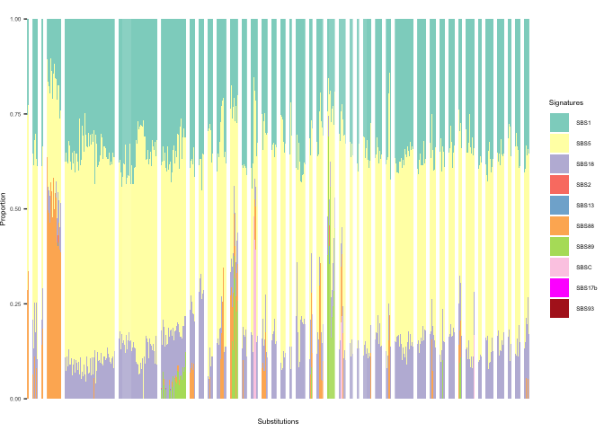<!-- -->


``` r
sig_order=1:7
names(sig_order)=c("ID1","ID2","ID5", "ID18","ID14","IDA","IDB")

getPalette = colorRampPalette(brewer.pal(6, "Set3"))
# all_cols=c(getPalette(6),'grey')
all_cols=c("#DDDCC7", "#FAEBEA", "#A6ADBA",'#F5B46F', "#DC978D","#533A4D","#6993A4")
names(all_cols)=c("ID1","ID2","ID5","ID18","ID14","IDA","IDB")

plot_IDexposre = ggplot(ID_sig_proportion[ID_sig_proportion$group=='Control',], aes(x = sample, y = E2, fill = E1)) + geom_bar(stat = "identity", show.legend = FALSE) +
    scale_fill_manual(values = all_cols) + theme_bw() + 
  theme(text = element_text(size = 6),
        axis.title.x = element_text(vjust=5),
        axis.text.x = element_blank(),
    axis.ticks.x = element_blank(),
    panel.grid = element_blank(), 
    panel.border = element_blank(), 
    strip.text = element_blank(),
    panel.spacing.x = unit(0.2, "lines"),
    plot.margin = margin(0,0,0,0, "cm"),
    legend.position = "none") +
    labs(x = "Indels", y = "Proportion", fill = "Signatures") + facet_grid(cols = vars(patient),
    scales = "free_x", space = "free")

plot_IDtotal <- ggplot(ID_sig_proportion[ID_sig_proportion$group == 'Control',], aes(x = sample, y = indeltotal_corr, fill = type)) +
  geom_bar( alpha = 0.8,stat = "identity",position = position_dodge(0.99), show.legend = FALSE) + 
  theme_bw() +scale_fill_manual(values = bar_cols)+
  theme(text = element_text(size = 6),
        axis.text.x = element_blank(),
        axis.ticks.x = element_blank(),
        panel.grid = element_blank(),
        panel.border = element_blank(),
        strip.text = element_blank(),
        axis.title.x = element_blank(),
        panel.spacing.x = unit(0.2, "lines"),
        plot.margin = margin(0,0,0,0, "cm")) +
  labs(x = "Indels", y = "Burden") + facet_grid(cols = vars(patient),
    scales = "free_x", space = "free")

Control_ID_plot <- ggarrange(plot_IDtotal, plot_IDexposre,
          ncol = 1, nrow=2,heights = c(1, 3), widths = c(6, 6), common.legend = TRUE, legend = "right", align = "v") 
Control_ID_plot 
```

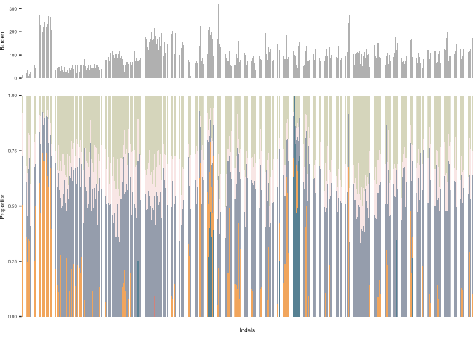<!-- -->


``` r
ggplot(ID_sig_proportion[ID_sig_proportion$group=='Control',], aes(x = sample, y = E2, fill = E1)) + geom_bar(stat = "identity") +
    scale_fill_manual(values = all_cols) + theme_bw() + 
  theme(text = element_text(size = 6),
        axis.title.x = element_text(vjust=5),
        axis.text.x = element_blank(),
        axis.ticks.x = element_blank(),
        panel.grid = element_blank(), 
        panel.border = element_blank(), 
        strip.text = element_blank(),
        panel.spacing.x = unit(0.2, "lines"),
        plot.margin = margin(0,0,0,0, "cm")) +
        labs(x = "Indels", y = "Proportion", fill = "Signatures") + facet_grid(cols = vars(patient),
        scales = "free_x", space = "free")
```

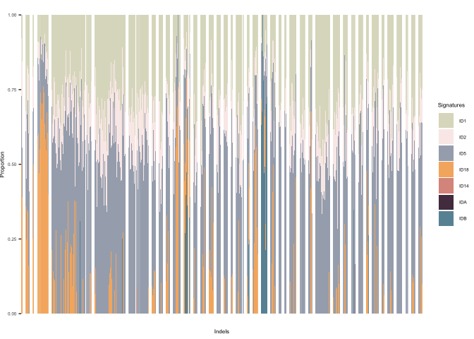<!-- -->


``` r
Control_plot<-ggarrange(Control_SBS_plot, Control_ID_plot,
          ncol = 1, nrow=2, common.legend = TRUE, legend = "right",  align = "v") 
Control_plot<-annotate_figure(Control_plot, top = text_grob("Control", 
               color = "black", face = "bold", size = 8))
# pdf(paste0("../../figure/Fig3/Contol_sigs.pdf"),width = 5, height = 3)
# Control_plot
# dev.off()
Control_plot
```

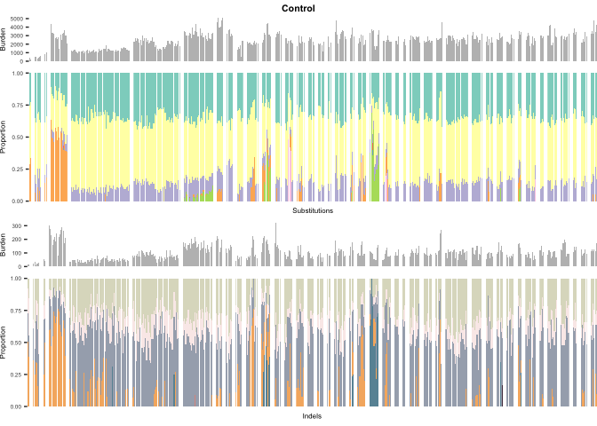<!-- -->


``` r
full_dataset = rbind(database,ctrl_database)
full_dataset=full_dataset[full_dataset$coverage>=10,]
full_dataset$group = 'Control'
full_dataset$group[!is.na(full_dataset$germlinehit)] = 'FAP'
full_dataset = full_dataset[!full_dataset$type %in% c('polyp','large polyp'),]
full_dataset$num_drivers = 3-(is.na(full_dataset$somatic1)+is.na(full_dataset$somatic2)+is.na(full_dataset$germlinehit))

df = full_dataset
df$type[df$group == 'Control'] = 'Normal crypts, Control, APC wt/wt'
df$type[df$num_drivers>1 & df$type=='normal'] = 'Normal crypts, FAP, APC mut/mut'
df$type[df$group=='FAP' & df$type=='normal' & is.na(df$trapped_in_polyp)] = 'Normal crypts, FAP, APC mut/wt'
df$type[df$type=='acf' & df$num_drivers>1] = 'ACF, FAP, APC mut/mut'
df$type[df$type %in% c('polyp','large polyp')] = 'Polyps, FAP'
df$type[(df$num_drivers<2) & df$type %in% c('acf','normal') & !is.na(df$trapped_in_polyp)]='Bystander crypts, FAP, APC mut/wt'
df$type[(df$num_drivers<2) & df$type %in% c('acf')]='Bystander crypts, FAP, APC mut/wt'
df = df[df$type!='Polyps, FAP',]
df$type = factor(df$type, levels = c('ACF, FAP, APC mut/mut', 'Normal crypts, FAP, APC mut/mut','Bystander crypts, FAP, APC mut/wt', 'Normal crypts, FAP, APC mut/wt','Normal crypts, Control, APC wt/wt' ))

dot_cols = c("#DF5B3F", "#F5B46F", "#3E517A","#70A3C4", "#C7E5EC")
names(dot_cols) = c('ACF, FAP, APC mut/mut', 'Normal crypts, FAP, APC mut/mut','Bystander crypts, FAP, APC mut/wt', 'Normal crypts, FAP, APC mut/wt','Normal crypts, Control, APC wt/wt' )

labels_html <- c(
  "ACF, FAP,<br><i>APC</i><sup>mut/mut</sup>",
  "Normal crypts, FAP,<br><i>APC</i><sup>mut/mut</sup>",
  "Bystander crypts, FAP,<br><i>APC</i><sup>mut/wt</sup>",
  "Normal crypts, FAP,<br><i>APC</i><sup>mut/wt</sup>",
  "Normal crypts, Control,<br><i>APC</i><sup>wt/wt</sup>"
)

p_sbs1 = ggplot(data = df, mapping = aes(x = age, y = SBS1)) +
    # geom_point(aes(colour = type), size = 0.5, alpha = 0.6) +
    geom_jitter(aes(colour = type), width = 0.3, height = 0, alpha = 0.8, size = 0.5) +
    scale_color_manual(name = "Group", values = dot_cols, labels = labels_html)+
    theme_bw() + theme(panel.grid = element_blank(), panel.border = element_blank(),
    axis.line = element_line(size = 0.5, colour = "black")) +
    labs(y = "SBS1 / crypt",
    x = "Age (yrs)") + theme(title = element_text(size = 8), axis.text.y = element_text(size = 8,
    color = "black"), axis.text.x = element_text(size = 8, color = "black"),
    legend.text = ggtext::element_markdown(size = 8))
p_sbs1
```

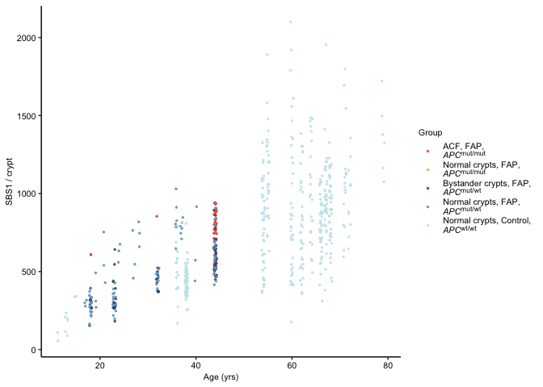<!-- -->


``` r
p_sbs5 = ggplot(data = df, mapping = aes(x = age, y = SBS5)) +
    # geom_point(aes(colour = type), size = 0.5, alpha = 0.6) +
    geom_jitter(aes(colour = type), width = 0.3, height = 0, alpha = 0.8, size = 0.5) +
    scale_color_manual(name = "Group", values = dot_cols, labels = labels_html)+
    theme_bw() + theme(panel.grid = element_blank(), panel.border = element_blank(),
    axis.line = element_line(size = 0.5, colour = "black")) +
    labs(y = "SBS5 / crypt",
    x = "Age (yrs)") + theme(title = element_text(size = 8), axis.text.y = element_text(size = 8,
    color = "black"), axis.text.x = element_text(size = 8, color = "black"),
    legend.text = ggtext::element_markdown(size = 8))
p_sbs5
```

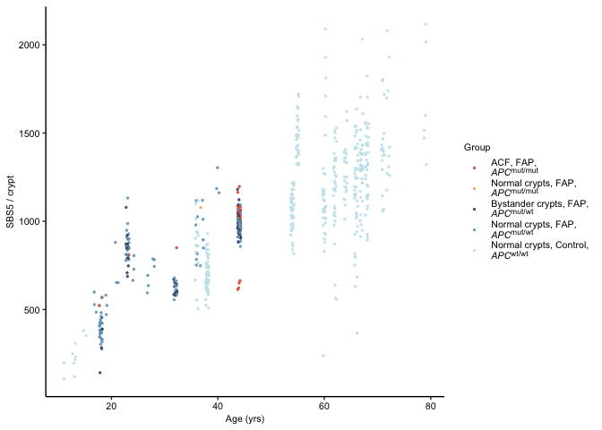<!-- -->


``` r
p_sbs18 = ggplot(data = df, mapping = aes(x = age, y = SBS18)) +
    # geom_point(aes(colour = type), size = 0.5, alpha = 0.6) +
    geom_jitter(aes(colour = type), width = 0.3, height = 0, alpha = 0.8, size = 0.5) +
    scale_color_manual(name = "Group", values = dot_cols, labels = labels_html)+
    theme_bw() + theme(panel.grid = element_blank(), panel.border = element_blank(),
    axis.line = element_line(size = 0.5, colour = "black")) +
    labs(y = "SBS18 / crypt",
    x = "Age (yrs)") + theme(title = element_text(size = 8), axis.text.y = element_text(size = 8,
    color = "black"), axis.text.x = element_text(size = 8, color = "black"),
    legend.text = ggtext::element_markdown(size = 8))
p_sbs18
```

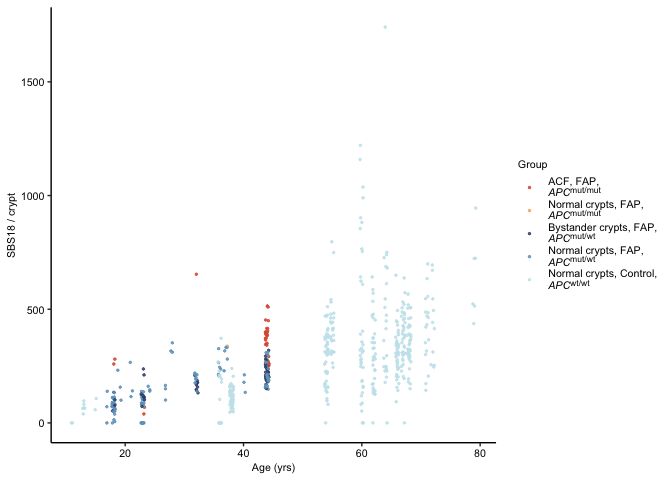<!-- -->


``` r
sbs_plot<-ggarrange(p_sbs1,p_sbs5,p_sbs18,
          ncol = 3, nrow=1, common.legend = TRUE, legend = "bottom",  align = "v") 

# pdf(paste0("../../figure/Fig3/sbs_plot.pdf"),width = 7, height = 3)
# sbs_plot
# dev.off()

sbs_plot
```

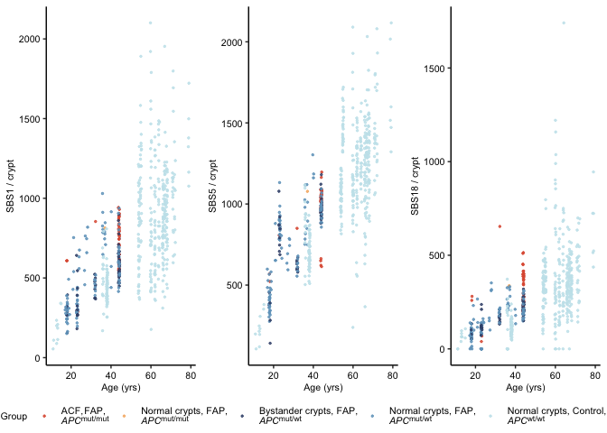<!-- -->
